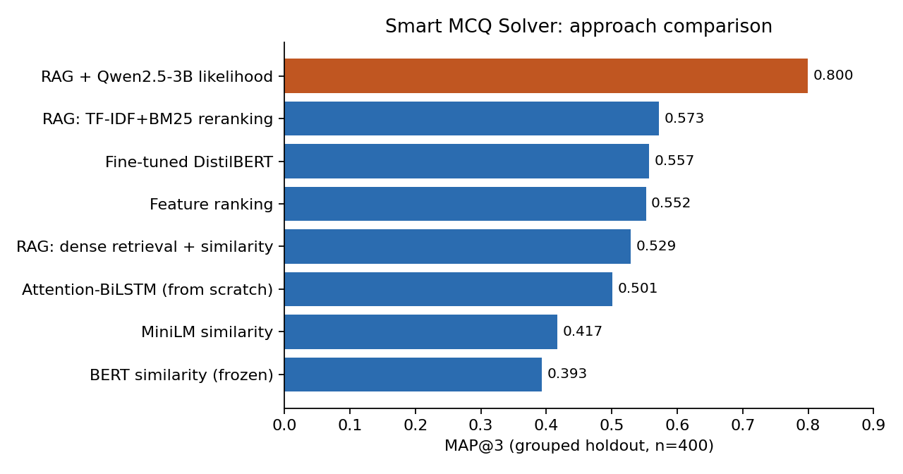

<<<<<<< HEAD
# Smart MCQ Solver — Retrieval, Transformers & LLM Ranking

A portfolio-ready version of my machine-learning competition project for ranking the three most likely answers to multiple-choice questions.

## Highlights

- Built and compared heuristic, embedding, supervised Transformer, BiLSTM, retrieval, reranking and LLM-based approaches.
- Used a grouped evaluation split to avoid complete A–E option-set overlap between the knowledge/training partition and evaluation partition.
- Implemented dense retrieval with Sentence Transformers + FAISS and sparse retrieval/reranking with TF-IDF/BM25.
- Fine-tuned DistilBERT for multiple-choice classification.
- Evaluated Qwen 2.5 3B candidate likelihood scoring.
- Best recorded grouped-holdout result: **0.7996 MAP@3**.

## Repository

```text
smart-mcq-solver/
├── README.md
├── requirements.txt
└── smart_mcq_solver.ipynb
```

## Notebook

Open `smart_mcq_solver_portfolio.ipynb` to see the complete documented workflow.

## Important

This is a research/portfolio project developed from a competition workflow. It is not presented as a production system. Expensive model cells may require a CUDA-enabled GPU.
=======
# Smart MCQ Solver: Retrieval, Transformers & LLM Ranking


Rank the **top 3 most likely answers** for five-option multiple-choice questions (A–E), evaluated with **MAP@3**.
Built for the *Smart MCQ Solver Challenge* (Kaggle) in the IIT Madras Deep Learning & Generative AI course.
I compared eight approaches, from a hand-crafted baseline to zero-shot LLM scoring, on a leakage-controlled split.



| Approach | MAP@3 | Accuracy | Macro-F1 |
|---|---:|---:|---:|
| Feature ranking (length, overlap) | 0.5521 | 0.3550 | 0.3756 |
| BERT similarity (frozen) | 0.3933 | 0.2400 | 0.2462 |
| MiniLM similarity | 0.4167 | 0.2700 | 0.2651 |
| Fine-tuned DistilBERT (multiple choice) | 0.5571 | 0.4025 | 0.3985 |
| Attention-BiLSTM (from scratch) | 0.5013 | 0.3000 | 0.2973 |
| RAG: dense retrieval + similarity | 0.5288 | 0.4250 | 0.4207 |
| RAG: TF-IDF + BM25 reranking | 0.5725 | 0.4550 | 0.4561 |
| **RAG + Qwen2.5-3B letter likelihood** | **0.7996** | **0.6975** | **0.6954** |

Grouped holdout, 400 questions, seed 42. Raw numbers: [`results/results.csv`](results/results.csv).

## Key findings

- Generic embedding similarity (BERT, MiniLM) scored **below** a simple length/overlap baseline.
- Fine-tuning DistilBERT on ~1.6k questions beat the frozen embedding baselines, but not the length/overlap baseline by much. The from-scratch BiLSTM overfit almost immediately (train loss fell to 0.03 while eval loss stayed above 1.6).
- Scoring each answer letter by LLM log-likelihood, with retrieved context, gave the largest jump (+0.23 MAP@3 over reranking) with no fine-tuning.

## Approach


**Leakage control.** Many questions are near-duplicates that share an identical A–E option set. A random split would let retrieval and fine-tuning memorise answers, so `grouped_split` assigns whole option sets to either the knowledge base (80%) or the evaluation set (20%) and asserts zero overlap.

## Quick start

```bash
git clone https://github.com/<your-username>/smart-mcq-solver && cd smart-mcq-solver
python -m venv .venv && source .venv/bin/activate
pip install -r requirements.txt
# put train.csv / test.csv in data/  (see data/README.md)

jupyter notebook notebooks/smart_mcq_solver.ipynb            # full narrative, all experiments
python scripts/run_experiments.py --models features hybrid   # CPU-friendly subset
python scripts/run_experiments.py --models all               # GPU needed for DistilBERT / Qwen
pytest -q                                                    # unit tests (no GPU, no data)
```

## Project structure

```
├── notebooks/smart_mcq_solver.ipynb   # end-to-end experiments with outputs
├── src/mcq_solver/
│   ├── data.py          # loading + grouped leakage-free split
│   ├── metrics.py       # MAP@3, accuracy, macro-F1
│   ├── baselines.py     # feature ranking, embedding similarity
│   ├── retrieval.py     # FAISS dense retriever, TF-IDF+BM25 hybrid reranker
│   ├── supervised.py    # DistilBERT multiple-choice, Attention-BiLSTM
│   └── llm_scoring.py   # Qwen letter log-likelihood scorer
├── scripts/run_experiments.py
├── tests/               # metric, split and retrieval tests (run in CI)
├── results/results.csv
└── data/README.md       # where to put the competition data
```

## Limitations

- **Local vs leaderboard.** The TF-IDF+BM25 pipeline scored 0.5725 locally but 0.74747 on the Kaggle public leaderboard. The Kaggle test set shares option sets with the training data, so the exact-signature lookup helps there; the grouped split removes that shortcut by design. The grouped score is the better estimate of generalisation.
- **Small, single-seed evaluation** (400 questions): gaps of a few MAP@3 points between close models are within noise.
- **Mild selection bias** for DistilBERT/BiLSTM: the reported eval set is also used to choose the epoch / monitor loss.
- **No retrieval ablation for Qwen.** I did not run the LLM without retrieved context, so how much of the 0.80 comes from retrieval is untested.
- The knowledge base is the training split, so this is a controlled experiment rather than an open-domain RAG system.

## Possible next steps

Qwen without context (ablation) and with more retrieved chunks; multiple seeds with confidence intervals; a separate validation split; LoRA fine-tuning of the LLM; ensembling the reranker and LLM scores.

## License

MIT. The competition data is not redistributed.
>>>>>>> 1dce701 (new workflow)
